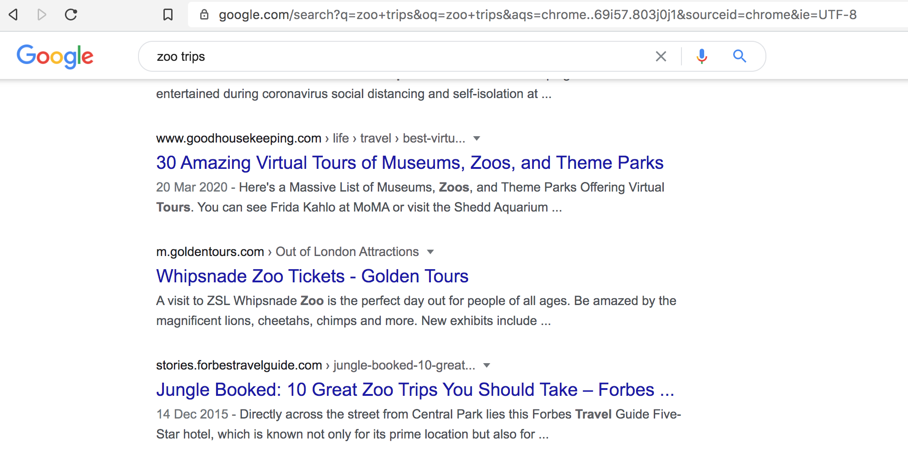
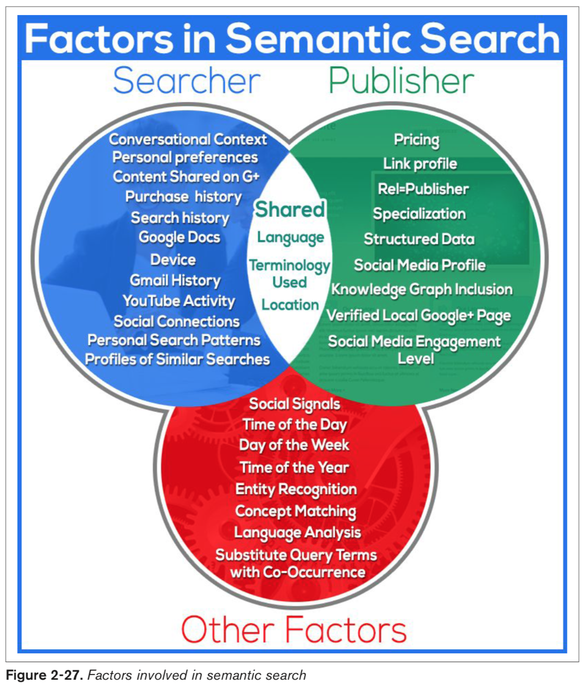

> Therefore, a crucial element to building an online marketing strategy around SEO and organic (sometimes referred 
>to as “natural”) search visibility is understanding your audience and how they think about, discuss, and search for 
>your service, product, and brand. (p.44)
>

In contrast, data shows that you may not want to be #1 in the paid search results, because the resulting cost to gain the #1 position in a PPC campaign can reduce the
total net margin on your campaign
p.62

Even if your organic ranking is #1, you can still increase the ranking page’s click rate by having a sponsored ad above it or in the righthand column. The AdGooroo survey showed that having a prominent paid ad on the same search results page makes your #1 organic ranking receive as much as 20% more clicks.
p.63

Screenshot the CTR tables on p.65 - v. useful

In the search marketing field, the pages the engines return to fulfill a query are referred to as search engine results pages (SERPs).
p.68

For the SEO practitioner, get- ting placed in this vertical result could be a significant win.
p.73

Crawling and indexing trillions of documents (pages and files) on the Web (note that they ignore pages that they consider to be “insignificant,” 
perhaps because the pages are perceived as adding no new value or are not referenced at all on the Web).
p.78

You can think of relevance as the first step to being “in the game.” If you are not relevant to a query, the search
engine does not consider you for inclusion in the search results for that query. We will discuss how relevance is 
determined in more detail in “Determining Searcher Intent and Delivering Relevant, Fresh Content” on page 92.
Importance refers to the relative importance, measured via citation (the act of one work referencing another, 
as often occurs in academic and business documents), of a given document that matches the user’s query. The 
importance of a given document increases with every other document that references it. In today’s online 
environment, citations can come in the form of links to the document or references to it on social media sites. 
Determining how to weight these signals is known as citation analysis.
p.80

You can think of importance as a way to determine which page, from a group of equally relevant pages, shows up first in the search results, 
which is second, and so forth. The relative authority of the site, and the trust the search engine has in it, 
are significant parts of this determination. Of course, the equation is a bit more complex than this, and not all 
pages are equally relevant. Ultimately, it is the combination of relevance and importance that determines the 
ranking order.
p.81

In addition, search engines read a few other elements. One of these is the page title. The page title is one of 
the most important factors in ranking a given web page. It is the text that shows in the browser’s title bar 
(above the browser menu and the address bar).
p.86

In addition to page titles, search engines previously used the meta keywords tag. This is a list of keywords that 
you wish to have associated with the page. Spammers (people who attempt to manipulate search engine results in 
violation of the search engine guidelines) ruined the SEO value of this tag many years ago, so its value is now 
negligible, as search engines don’t use it anymore. Spending time on meta keywords is not recommended because of 
the lack of SEO benefit.
p.87

Search engines also read the meta description tag (the third highlighted area in the HTML source in Figure 2-18). 
However, the content of a meta description tag is not directly used by search engines in their ranking algorithms.
Nonetheless, the meta description tag plays a key role, as search engines often use it as a part or all of the 
description for your page in search results. Therefore, a well-written meta description can have a significant 
influence on how many clicks you get on your search listing, and the click-through rate on your search listing 
can impact your ranking. As a result, time spent on meta descriptions is quite valuable.
Figure 2-20 uses a search on trip advisor to show an example of the meta description tag being used as a 
description in the search results.
pp.87-88

Search engines also read the text contained in the alt attribute of an image tag (). An image tag is an element that is used to tell a web page to display an image.
p.88

doesn't read flash
p.90

Audio and video files are also not easy for search engines to read. As with images, the data is not easy to parse. There are a few exceptions where the search engines can extract some limited data, such as ID3 tags within MP3 files, or enhanced podcasts in AAC format with textual “show notes,” images, and chapter markers embedded. Ulti- mately, though, search engines cannot distinguish a video of a soccer game from a video of a forest fire.
p.90

As of HTML 5, a construct known as the embed tag (<embed>) was created to allow the incorporation of plug-ins into an HTML page. Plug-ins are programs located on the user’s computer, not on the web server of your website. The embed tag is often used to incorporate movies or audio files into a web page; it tells the plug-in where it should look to find the data file to use. Content included through plug-ins may or may not be invisible to search engines
p.91

However, the search engines recognize an iframe or a frame used to pull in another site’s content for what it is, and therefore may ignore that content. In other words, they don’t con- sider content pulled in from another site as part of the unique content of your web page.
p.91 

Modern commercial search engines rely on the science of information retrieval (IR). This science has existed since the middle of the 20th century, when retrieval systems pow- ered computers in libraries, research facilities, and government labs. Early in the development of search systems, IR scientists realized that two critical components comprised the majority of search functionality: relevance and importance (which we defined earlier in this chapter). To measure these factors, search engines perform document analysis (including semantic analysis of concepts across documents) and link (or citation) analysis.
p.92

Reliance on document analysis alone is not enough for today’s search engines, so they also look at semantic connectivity. Semantic connectivity refers to words or phrases that are commonly associated with one another
p.92

for those advanced practitioners who seek every advantage, semantic connectivity measurements can help in each of the following sectors:
• Measuring which keyword phrases to target
• Measuring which keyword phrases to include on a page about a certain topic • Measuring the relationships of text on other high-ranking sites and pages
• Finding pages that provide “relevant” themed links
p.93

Common types of searches in the IR field include:
Proximity searches
A proximity search uses the order of the search phrase to find related documents. For example, when you search for “sweet German mustard” you are specifying only a precise proximity match. If the quotes are removed, the proximity of the search terms still matters to the search engine, but it will now show documents that don’t exactly match the order of the search phrase, such as Sweet Mustard— German.
Fuzzy logic
Fuzzy logic technically refers to logic that is not categorically true or false. A com- mon example is whether a day is sunny (i.e., is 50% cloud cover a sunny day?). In search, fuzzy logic is often used for misspellings.
Boolean searches
These are searches that use Boolean terms such as AND, OR, and NOT. This type of logic is used to expand or restrict which documents are returned in a search.
Term weighting
Term weighting refers to the importance of a particular search term to the query. The idea is to weight particular terms more heavily than others to produce supe
rior search results. For example, the appearance of the word the in a query will receive very little weight in selecting the results because it appears in nearly all English language documents. There is nothing unique about it, and it does not help in document selection.
p.93

For example, a search engine would recognize that trips to the zoo often include viewing wildlife and animals, possibly as part of a tour.
To see this in action, conduct a search on Google for zoo trips. Note that the boldface words that are returned match the terms that are italicized in the preceding paragraph. Google is setting “related” terms in boldface and recognizing which terms frequently occur concurrently (together, on the same page, or in close proximity) in their indexes.
p.94

It will be important going into the future to realize search engines’ ability to pick 
up on ideas and themes and recognize content, links, and pages that don’t fit well into the scheme of a website.
p.96

- spelling andd grammar
- reading level of the document
- Interaction with web search results

What matters most is how your site compares to that of your competition. If your site has better engagement 
metrics, this is likely to be seen as an indication of quality and can potentially boost your rankings with 
respect to your competitors
p.98

In link analysis, search engines measure who is linking to a site or page and what they are saying about that site/page.
Links from a highly authoritative page on a highly authoritative site will count more than other links of lesser authority

This brings up an important ranking concept. It is possible that a strict analysis of the relevance and link-driven 
importance scores in Figure 2-24 would not have resulted by itself in the Investopedia.com result being on the
first page, but the need for diver- sity elevated the page’s ranking. This concept of altering the results in this
manner is sometimes referred to as query deserves diversity (QDD).
p.101

In addition, Google is investing in ways to more reliably extract information from other sources, including websites, to present as direct answers in search. Google refers to these as “featured snippets.” Figure 2-26 shows the search result for buying a car.
p.105

p.107

Analyzing Ranking Factors
Moz periodically conducts surveys of leading SEOs to determine what they think are the most important ranking factors.12 Here is a high-level summary of the top nine results, in priority order (as suggested by the referenced study):
• Domain-level link authority features • Page-level link metrics
• Page-level keywords and content
• Page-level keyword-agnostic features • Domain-level brand metrics
• Usage and traffic/query data
• Page-level social metrics
• Domain-level keyword usage
• Domain-level keyword-agnostic features
Here is a brief look at each of these:
Domain-level link authority features
Domain-level link authority is based on a cumulative link analysis of all the links to the domain. This includes factors such as the number of different domains link- ing to the site, the trust/authority of those domains, the rate at which new inbound links are added, the relevance of the linking domains, and more.
Page-level link metrics
This refers to the links as related to the specific page, such as the number of links, the relevance of the links, and the trust and authority of the links received by the page.
Page-level keywords and content
This describes the use of the keyword term/phrase in particular parts of the HTML code on the page (<title> tag, <h1>, alt attributes, etc.).
Page-level features other than keywords
Factors included here are page elements such as the number of links on the page, number of internal links, number of followed links, number of “nofollow” links, and other similar factors.
Domain-level brand metrics
This factor includes search volume on the website’s brand name, mentions, whether it has a presence in social media, and other brand-related metrics.
Page-level traffic/query data
Elements of this factor are click-through rate to the page in the search results, bounce rate of visitors to the page, and other similar measurements.
Page-level social metrics
Social metrics considered include mentions, links, shares, likes, and other social media site–based metrics. It should be emphasized that many SEO practitioners believe that this is a ranking factor even though studies have since shown other- wise, and representatives from Google clearly state that social signals are not part of their algorithm.
Domain-level keyword usage
This refers to how keywords are used in the root or subdomain name, and how impactful that might be on search engine rankings.
Domain-level keyword-agnostic features
Major elements of this factor in the survey include the number of hyphens in the domain name, number of characters in the domain name, and domain name length.

[...]

Some other potential negative ranking factors include:
Malware being hosted on the site
The search engines will act rapidly to penalize sites that contain viruses or Trojans.
Cloaking
Search engines want publishers to show the same content to the search engine as is shown to users.
Pages on the sites with links for sale
Google has a strong policy against paid links, and sites that sell links may be penalized.
Content that advertises paid links on the site
As an extension of the prior negative ranking factor, promoting the sale of paid links may be a negative ranking factor.
Page speed
Back in 2010, Google’s Matt Cutts announced that Google was making page speed a ranking factor. In general, it is believed that this is a negative factor for pages that are exceptionally slow.

pp.108-110 [IMP]

http://appft1.uspto.gov/netacgi/nph-Parser?Sect1=PTO1&Sect2=HITOFF&d=PG01&p=1&u=/netahtml/PTO/srchnum.html&r=1&f=G&l=50&s1=%2220050071741%22.PGNR.&OS=DN/20050071741&RS=DN/20050071741

The site: query is notoriously inaccurate. You can obtain a more accu- rate count of the pages of your site indexed by 
Google by appending &start=990&filter=0 to the URL of a Google set for a search using the site: operator.
p.115

You can gain significant traffic by optimizing for video search engines and participating in them. 
Once again, these are binary files and the search engine cannot easily tell what is inside them.
p.125

Google has implemented a search engine focused just on blog search called Google Blog Search 
(misnamed because it is an RSS feed engine, not a blog engine). This search engine will respond to queries, 
but only searches blogs (more accurately, feeds) to determine the results. Figure 2-34 is an example search 
result for the search phrase barack obama.
p.127

• Owning the proper domain extension (e.g., .com.au, .uk, .fr, .de, .nl) for the country that your business is targeting
• Hosting your website in the country you are targeting (with a country-specific IP address)
• Registering with local search engines: — Google My Business
— Yahoo! Small Business
— Bing Places
• Having other sites from the same country link to you
• Using the native language on the site (an absolute requirement for usability)
• Helping Google serve the correct language or regional URL in the search results by adding the hreflang attribute (https://support.google.com/webmasters/answer/189077? hl=en)
• Placing your relevant local address data on major pages of the site
• Setting your geographic target in Google Search Console (you can read more
about this at http://bit.ly/country_targeting); note that Google does not really need
you to do this if your site is on a country code top-level domain (ccTLD), such as .de or .co.uk, as the preferred regional target is assumed
All of these factors act as strong signals to the search engines regarding the country you are targeting, and will make them more likely to show your site as a relevant local result.

pp.133-134

While SEO can be viewed as a project (and there are certainly situa- tions in which SEO “projects” exist) the best
investment, in our opinion, is to treat it as more of a process—one that is iterative and ongoing, and requires 
steady commitment from the stakeholders of an organization.
p.136

Developing an SEO strategy involves performing extensive keyword research (which we will discuss in Chapter 5) 
to determine which search queries people actually use.
p.137

Capturing that traffic could provide the manufacturer with incremental sales of its electric vehicles that 
it probably would not have gotten otherwise. Knowing these fac- tors, the SEO process involves developing 
a site architecture strategy (see Chapter 6) and a content development/editorial strategy (Chapter 7) to 
help the site’s pages achieve competitive search engine exposure for a broad range of potentially relevant terms.
p.137

SEO professionals must maintain a research process for analyz- ing how the search landscape is changing.
p.138

Navigational query
This is a query with the intent to arrive at a specific website or page (e.g., the per- son types in your company domain name, www.companyname.com, or simply types in the word facebook).
Informational query
This is a search performed to receive an answer to a broad or direct question, or to research and explore information around a specific topic with no specific source in mind (e.g., yoga poses).
Transactional query
A person who types in digital camera may be looking to buy one now, but it is equally possible that she is researching digital cameras to learn about how they are different from film cameras. This is an example of an initial transactional query, which can evolve in stages. For example, here are some other types of transactional queries that occur at a later stage in the buying cycle:
• The user types in best online digital camera store. Although there is no informa- tion in the query about which one she wants to buy, the intent is clearer that the searcher is seeking a store, not simply information about types of digital cameras.
• The searcher types in olympus OMD lowest price. The chances are very high that this user is looking to buy that particular camera.
Part of an SEO strategy is to understand how the various types of searches relate to the content and architecture of your website.
p.139-p.140

How people search for products like yours
Understanding what customers do when they are searching for products or serv- ices like yours is one of the most basic functions of SEO, which we will discuss in detail in Chapter 5. 
This involves mapping the actual search queries your target customers use when they go to a search engine.
p.141

You will need to understand both the broad and specific market categories that your products fall into, as each 
of these categories might relate to sections of your website that you will likely need to create. By having 
content areas of the site for those categories, you create the opportunity to obtain organic search traffic
related to those categories.
p.142

It has been debated since the late 1990s: whether content is king in SEO. Not only is content king for SEO 
purposes, but as the main driver of engagement on the Web, it is also one of the most important elements of any 
online effort. Development of high- quality, engaging content for your users increases the available real estate 
for organic search queries; provides your users reason to enjoy your site and compels them to become customers; 
and invites promotion and exposure through users sharing your content online, on social media platforms and via 
direct links from other websites. Determining your available content assets is the first step toward leveraging 
them within the context of SEO. You may have a deep library of “how to” content, great tes- timonial or product 
demonstration videos, a unique photo gallery, or an awesome tool that people are interested in using. All of 
these content types can be invaluable in building a world-class website that does well in both search engines 
and the overall web ecosystem.
p.142

To get a very quick read on keyword competitiveness, use the Google AdWords Key- word Planner to see what your 
cost per click (CPC) could be if you bid on your target phrase in a pay-per-click (PPC) campaign. Higher CPC 
prices in Google AdWords often mean that the terms are more competitive in organic search as well.
p.145

## SEO for ecommerce
Keyword targeting
PPC advertising is an excellent way to test the efficacy and potential ROI of key- word targets. Find those 
that have reasonable traffic and convert well, and pursue them further. You’ll often find that the more specific 
the query is—brand- inclusive, product-inclusive, and so on—the more likely visitors are to make the purchase. 
The best use of this tactic is for generic terms that you will find harder to win on than brand/company named 
terms, so you can decide if they are worth the effort.

Your site will need to provide interesting, unique, and accessible content for both users and search engines in 
order to begin gaining traction in organic search. The links and social sharing that come from such content are 
highly influential in increasing overall site traffic, as well as improving organic search performance. Creating 
link-worthy, deeply engaging content should be the primary focus of any website seeking search and referral 
traffic, and should be incorporated into both the content development and SEO strategies. Manual link building 
is always an option, but scalable strategies that leverage a community or customers can be equally, or even more, 
valuable. Remember: content that keeps users on the page, instead of prompting them to click away rapidly, is a 
signal of quality and also serves to increase the value of traffic to the page (improving page monetization 
through advertising).
p.147

To bring this all together successfully, your objectives, strategies, and tactics need to be aligned, and they 
need to take into account your market, your business, and the com- petition. Don’t spread yourself too thin. 
Remember to ask yourself the tough ques- tions, such as:
• Does your company need direct sales, traffic, branding, or some combination of these?
• Are there specific influencers you’re trying to reach with a message?
• Is the organization/brand subject to potentially negative material that needs to be controlled/mitigated?
• Do you have products/services you sell, either directly over the Web or through leads established online?
• Do you have the resources to develop new, unique, and interesting content?

As we outlined previously in this chapter, your technology choices can have a major impact on your SEO results. 
The following is an outline of the most important issues to address at the outset:
Dynamic URLs
Dynamic URLs are URLs for dynamic web pages (which have content generated “on the fly” by user requests). 
These URLs are generated in real time as the result of specific queries to a site’s database—for example, a 
search for leather bag on Etsy results in the dynamic search result URL https://www.etsy.com/search?q=leather%20ba
g. However, Etsy also has a static URL for a static page showing leather bags at 
https://www.etsy.com/market/leather_bag.
Although Google has stated for some time that dynamic URLs are not a problem for the search engine to crawl, 
it is wise to make sure your dynamic URLs are not “running wild” by checking that your CMS does not render your 
pages on URLs with too many convoluted parameters. In addition, be sure to make proper use of rel="canonical", as 
outlined by Google (http://bit.ly/canonical_urls).
Finally, while dynamic URLs are crawlable, don’t overlook the value of static URLs for the purpose of controlling
your URL structure for brevity, descriptiveness, user-friendliness, and ease of sharing.

Session IDs or user IDs in the URL
It used to be very common for a CMS to track individual users surfing a site by adding a tracking code to the 
end of the URL. Although this worked well for this purpose, it was not good for search engines, because they saw 
each URL as a dif- ferent page rather than a variant of the same page. Make sure your CMS does not ever serve up
session IDs. If you are not able to do this, make sure you use rel="canonical" on your URLs 

Superfluous parameters in the URL
Related to the preceding two items is the notion of extra characters being present in the URL. This may bother search 
engines, and it interferes with the user experi- ence for your site.

Links or content based in Flash
Search engines often cannot see links and content implemented with Flash tech- nology. Have a plan to expose 
your links and content in simple HTML text, and be aware of Flash’s limitations.

Content behind forms (including pull-down lists)
Making content accessible only after the user has completed a form (such as a login) or made a selection from an
improperly implemented pull-down list is a great way to hide content from the search engines. Do not use these 
techniques unless you want to hide your content!

Temporary (302) redirects
This is also a common problem in web server platforms and content management systems. The 302 redirect blocks a
search engine from recognizing that you have permanently moved the content, and it can be very problematic for
SEO, as 302 redirects block the passing of PageRank. Make sure the default redirect your systems use is a 301,
or learn how to configure it so that it becomes the default.

pp.159-160

Anchor text has generally been one of the golden opportunities of internal linking, and exact-match keyword 
anchor text was generally the protocol for internal linking for many years. However, in these days of aggressive
anchor text abuse (and crack- down by the search engines), while keyword-infused anchor text in internal links 
is still often the most intuitive and user-friendly, we generally advocate for a more broad-minded approach 
to crafting internal anchor text. Use descriptive text in your internal links and avoid using irrelevant text 
such as “More” or “Click here.” Try to be as specific and contextually relevant as possible and include phrases 
when appropriate within your link text
pp.162-163

Use breadcrumb navigation

Standard SEO advice is to keep the site architecture as flat as possible, to minimize clicks from the home page 
to important content. The bottom line is that you need to plan out a site structure that is as flat as you can 
reasonably make it without compro- mising your user experience.

p.164

Server rendering versus client-Only rendering. If the website owner doesn’t care about achieving top ranking, and the only goal is getting indexed—and, the only goal is to get indexed by Google, not any other search engine—then it is OK to do client- only rendering with Angular. Google has gotten very good recently at indexing client rendered HTML. If you go down this route, you will need to do the following:
1. Enable push state in Angular so you get pretty URLs without the hash.
2. Implement UI Router or the new Component Router in Angular so you can map URLs to pages.
3. Follow all normal SEO best practices for page titles, URLs, content, etc. Nothing changes here.
4. Optimize the heck out of the initial page load—a major mistake many make is thinking initial page load time for client-rendered apps doesn’t matter, but it does!

p.165

# Elements of an Audit
- Page load time
- Mobile-friendliness
- Usability
- Accessibility/spiderability
Make sure the site is friendly to search engine spiders (discussed in more detail in 
“Making Your Site Accessible to Search Engines” on page 259 and “Creating an Optimal Information Architecture” 
on page 267).

Search engine health checks
Here are some quick health checks:
• Perform a site:<yourdomain.com> search in the search engines to check how many of your pages appear 
to be in the index. Compare this to the number of unique pages you believe you have on your site. Also, check 
indexation numbers in your Google Search Console and Bing Webmaster Tools accounts.
• Check the Google cache to make sure the cached versions of your pages look the same as the live versions.
• Check to ensure major search engine Search Console and Webmaster Tools accounts have been verified for the 
domain (and any subdomains, for mobile or other content areas). Google and Bing currently offer site owner 
validation to “peek” under the hood of how the engines view your site.
• Test a search on your brand terms to make sure you are ranking for them (if not, you may be suffering from a penalty; 
be sure to check your associated Search Console/Webmaster Tools accounts to see if there are any identifiable penalties, or any other helpful information).

Keyword health checks
Are the right keywords being targeted? Does the site architecture logically flow from the way users search on 
related keywords? Does more than one page target the same exact keyword (a.k.a. keyword cannibalization)? 
We will discuss these items in “Key- word Targeting” on page 297.

Duplicate content checks
The first thing you should do is make sure the non-www versions of your pages (i.e., http://yourdomain.com) 
301-redirect to the www versions (i.e., http://www.yourdo- main.com), or vice versa (this is often called the 
canonical redirect). While you are at it, check that you don’t have https: pages that are duplicates of your 
http: pages. You should check the rest of the content on the site as well.

URL checks
Make sure you have clean, short, descriptive URLs. Descriptive means keyword-rich but not keyword-stuffed 
(e.g., site.com/outerwear/mens/hats is keyword-rich; site.com/outer- wear/mens/hat-hats-hats-for-men is 
keyword-stuffed!). You don’t want parameters appended (have a minimal number if you must have any), and you want 
them to be simple and easy for users (and search engine spiders) to understand.

HTML <title> tag review
Make sure the <title> tag on each page of the site is unique and descriptive. If you want to include your company 
brand name in the title, consider putting it at the end of the <title> tag, not at the beginning, as placing 
keywords at the front of a page title (generally referred to as prominence) brings ranking benefits. Also check 
to ensure the <title> tag is fewer than 70 characters long, or 512 pixels wide.

Content review
Do the main pages of the site have enough text content to engage and satisfy a site visitor? Do these pages all 
make use of header tags? A subtler variation of this is mak- ing sure the number of pages with little content on 
the site is not too high compared to the total number of pages on the site.

Meta tag review
Check for a meta robots tag on the pages of the site. If you find one, you may have already spotted trouble. 
An unintentional noindex or nofollow value (we define these in “Content Delivery and Search Spider Control” 
on page 334) could adversely affect your SEO efforts.
Also make sure every page has a unique meta description. If for some reason that is not possible, consider 
removing the meta description altogether. Although the meta description tags are generally not a direct factor 
in ranking, they may well be used in duplicate content calculations, and the search engines frequently use them 
as the description for your web page in the SERPs; therefore, they can affect click-though rate.

Sitemaps file and robots.txt file verification
Use the Google Search Console “Robots.txt fetch” to check your robots.txt file. Also verify that your Sitemap file 
is correctly identifying all of your site pages.

URL redirect checks
Check all redirects to make sure the right redirect is in place, and it is pointing to the correct destination URL.
This also includes checking that the canonical redirect is properly implemented. Use a server header checker such 
as Redirect Check or RedirectCh- ecker.org, or when using Firefox, install the browser extension Redirect Check 
Client.

Internal linking checks
Look for pages that have excessive links. As discussed earlier, make sure the site makes intelligent use of 
anchor text in its internal links. This is a user-friendly opportunity to inform users and search engines what 
the various pages of your site are about. Don’t abuse it, though. For example, if you have a link to your home 
page in your global navigation (which you should), call it “Home” instead of picking your juiciest keyword. 
The search engines can view that particular practice as spammy, and it does not engender a good user experience.

You should link out to quality websites. It is good for users, and it is likely to bring you ranking benefits 
(through building trust and relevance based on what sites you link to).

Avoidance of unnecessary subdomains
The engines may not apply the entirety of a domain’s trust and link authority weight to subdomains. This is 
largely due to the fact that a subdomain could be under the control of a different party, and therefore in the 
search engine’s eyes it needs to be separately evaluated.

External linking
Check the inbound links to the site by performing a backlink analysis. Use a backlinking tool such as 
LinkResearchTools, Open Site Explorer, Majestic SEO, or Ahrefs Site Explorer & Backlink Checker to collect data 
about your links. Look for bad patterns in the anchor text, such as 87% of the links having the critical keyword
for the site in them. Unless the critical keyword happens to also be the name of the company, this is a sure 
sign of trouble. This type of distribution is quite likely the result of link purchas- ing or other manipulative
behavior, and will (if it hasn’t already) likely earn you a manual Google penalty or trigger Google’s Penguin
algorithm to lower your rankings.

On the flip side, make sure the site’s critical topics and keywords are showing up sometimes. A lack of the 
topically related anchor text is not entirely good, either. You need to find a balance, and err on the side of 
caution, intuitiveness, and usability.

Also check that there are links to pages other than the home page. These are often called deep links
https://bloggingx.com/deep-linking-for-seo/

Image alt attributes
Do all the images have relevant, keyword-rich alt attribute text and filenames?

The Importance of Keyword Reviews

Step 1: Keyword research
It is vital to examine your topic and keyword strategy as early as possible in any SEO effort. 
You can read about this in more detail in Chapter 5.

Step 2: Site architecture
Coming up with architecture for a website can be very tricky. At this stage, you need to look at your keyword 
research and the existing site (to make as few changes as pos- sible). You can think of this in terms of your 
site map.

You need a hierarchy that leads site visitors to your high-value pages (i.e., the pages where conversions are 
most likely to occur). Obviously, a good site hierarchy allows the parents of your “money pages” to rank for 
relevant keywords, which are likely to be shorter tail.

Step 3: Keyword mapping
Once you have a list of keywords and a good sense of the overall architecture, start mapping the major 
relevant keywords to URLs

Step 4: Site review
Once you are armed with your keyword mapping, the rest of the site review will flow more easily

pp.165-172 [key pages]

As mentioned earlier, other valuable sources of data include Google Search Console and Bing Webmaster Tools. We cover these extensively in “Using Search Engine–Sup- plied SEO Tools” on page 841.
From a planning perspective, you will want to get these tools in place as soon as possi- ble
p.178

Understanding the competition should be a key component of planning your SEO strategy. The first step is to 
understand who your competitors in the search results really are. It can often be small players who give you
a run for your money.
p.179
How do you know whether a top-ranking site is playing by the rules? Look for dubi- ous links to the site using a 
backlink analysis tool such as Majestic SEO or Open Site Explorer (discussed earlier in this chapter)

Let’s assume your investigation has led you to identify several competitors who are gaining excellent search 
placement using legitimate, intelligent tactics. Now it is time to identify their strategy and tactics:
What keywords are they targeting?
You can determine this by looking at the page titles (up in the bar above the address bar at the top of your 
web browser, which also appears in the search results listings) of each competitor’s home page and product 
category pages. You can also use various online tools to see what keywords they may be targeting with PPC 
advertising; while it’s not always an indication that they are investing in SEO, you can still get a solid 
grasp on their overall keyword strategy.
Who’s linking to their home page, or to their top-selling product pages and category pages?
A link popularity checker can be quite helpful in analyzing this.
If it is a database-driven site, what technology workarounds are they using to get search engine spiders 
such as Googlebot to cope with the site being dynamic?
Nearly all the technology workarounds are tied to the ecommerce platforms the competitors are running. 
You can check to see whether they are using the same server software as you by using the “What’s that 
site running?” tool. Figure 4-9 shows a screenshot of a segment of the results for HSN.com.
p.181

Keyword Research
p.193
**Detailed Notes**

Keyword research tools provide valuable insight into the thinking of your potential customers. When users go 
to search engines and type out their search query, they may use language that is entirely different from what 
you expect.

As we laid out in Chapter 1, searchers often go through a progression where they try certain searches, check out
some sites, refine their searches, and repeat this process until they finally find what they want. 

>Taking the time to understand typical search sequences is one aspect that impacts your keyword strategy.

p.194

It is wonderful to deal with keywords that have 5,000 searches per day, or even 500 searches per day, but in 
reality these “popular” search terms may actually comprise less than 30% of the overall searches performed on 
the Web. The remaining 70% lie in what’s commonly called the “long tail” of search
p.194

What this means from an SEO perspective is that the exact query a user may be searching for is less important 
than the intent behind it. While keyword research is still crucial, creating pages highly optimized to a specific
keyword is less important than creating extremely high-quality, unique content that answers the need or question 
behind the keyword query.

One easy way to begin this process is to gather your team in a conference room and then follow these steps:
1. Produce a list of key one- to three-word phrases that describe your products/services.
2. Spend some time coming up with synonyms that your potential customers might use for those products and services. Use a thesaurus to help you with this process.
3. Create a taxonomy of all the areas of focus in your industry. It can be helpful to imagine creating a directory for all the people, projects, ideas, and companies connected to your site. You can also look at sites that are leaders in the industry and study their site hierarchy as a way to start your thinking about a taxonomy.
4. Broaden your list by thinking of higher-level terms and topics of which your prod- ucts or services are a subset.
5. Review your existing site and extract what appear to be key phrases from your site.
6. Review industry association and/or media sites to see what phrases they use to discuss your topic area.
7. List all of your various brand terms.
8. List all of your products. If your site has a massive number of products, consider stepping back a level (or two) and listing the categories and subcategories.
9. Have your team imagine that they are potential customers, and ask them what they would type into a search engine if they were looking for something similar to your product or service.
10. Supplement this by asking some people outside your business what they would search for, preferably people who are not directly associated with the company. Consider also the value of performing actual market research with a test group of consumers in your demographic, and ask them the same question.
11. Use various tools (such as Google Search Console) to see what terms people are already using to come to your site, or what terms they are using within your site search tool if you have one.
p.200

1. Review your competitors’ websites and see what keywords and phrases they use for their products and services that compete with yours. Look also for unique var- iations and synonyms they incorporate into their language, and see if these indi- cate shifting trends in vernacular in your industry.
2. Record what nonbrand terms they use for their business.
3. Read any articles they have written that are published on sites other than their own.
4. Observe what the media may have had to say about them.
p.201

If you are new to keyword research, consider starting with the Google AdWords Key- word Planner (which is free 
with an AdWords account) and at least one of the paid tools, such as KeywordDiscovery.com. This will give you a 
rich, varied data set with which to begin your keyword research. Over time you can experiment with the other 
tools and adjust your process as you find tools that you prefer for one task or another.
p.202

Related terms
Several of the engines offer “related” terms, including Google, Yahoo!, Bing, Ask, and Yippy (which shows 
related terms in clusters, as shown in Figure 5-2). This data can be invaluable if you’re looking to find 
related terms that may not have come up through competitive analysis or brainstorming.
p.203

The Keyword Planner offers some useful information about your keyword campaigns, such as suggestions for 
similar keywords, an estimate of the keyword’s popularity, ad costs and positions, general search volume 
trend information, and keyword campaign suggestions for your site or your competi- tor’s site. The tool is 
great for compiling a lot of general information about a keyword.
p.212

Google Trends is a great, easy tool for comparing keywords and identifying which term is more popular than 
the other; in addition, you can examine this data over many years with seasonality factored in
p.214
---
Open questions:

- Better to focus on a specific post for link building or just the root domain?
- Can I cross-post blog content on reddit/IH without a duplicate penalty? 

---

*If you found this guide useful, please consider [signing up to our mailing list](/), as we produce quality content 
on a regular basis*