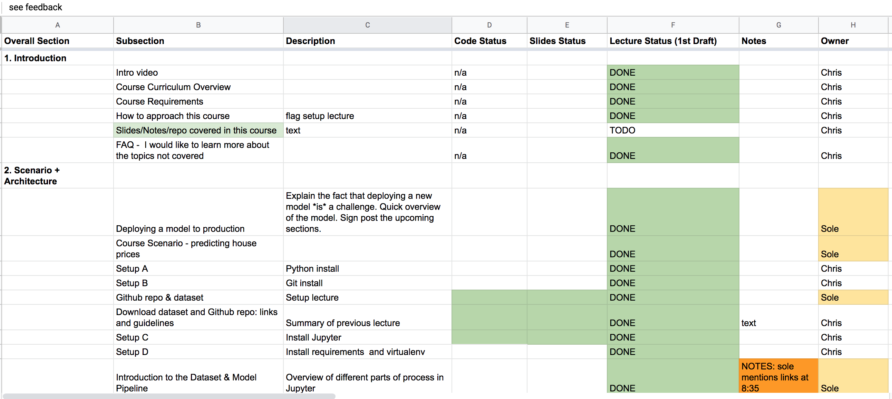

This is part of our [ultimate guide to online course creation](/blog/create-sell-online-courses-ultimate-guide/). 
At this point you should have:
- [Come up with your course topic](/blog/create-sell-online-courses-ultimate-guide/#deciding)
- [Validated your idea](/blog/create-sell-online-courses-ultimate-guide/#validation)
 
The first time you create an online course, it is hard to know where to begin. And once you've identified your course topic, what next? 
A key tool to keep you moving forward is a course content outline. 
Your online course outline or curriculum is a description of both the material you will teach in your course and the order of the lessons. 
Course curriculum design is an exercise in curation. For any topic which you are considering teaching, it is likely that there is a 
large amount of course content that you *could* teach, but if you were to teach all that material then your course might never launch. 
The number of individual lessons would be too large. There is also the possibility that you will want to save some of the material 
for a future course.
 
On the other hand, students are far less likely to buy a short course. Therefore a sensible balance must be found.

 
How do you find this balance? A few key areas to consider are:
 
- **How are you positioning your course?** If you are branding the course as a "comprehensive course" on a given topic
it's unlikely that you will be able to skip any key content in your course design. On the other hand it is perfectly reasonable to skip
basic content for a course that is branded as "Advanced".
- **What content does the competition offer** (particularly those with a lot of sales and high ratings)
- **Are there sections whose omission is likely to harm the students' learning experience?**
 
Make sure you are familiar with the [principle of diminishing returns](https://en.wikipedia.org/wiki/Diminishing_returns),
i.e. there will come a point where adding more lectures does not significantly improve student experience and outcomes.
 
It's worth drawing that point out more. 

>You are optimizing for two things with your online course: (1) Student experience
and (2) Student Outcomes. 

These are not the same thing! A course can have terrible production value and mostly awful content,
but if it teaches something which gets the student a promotion then that is a huge outcome. To be clear, you need to
optimize for **both** of these factors, and the course curriculum design is one of the key ways you do this.
 
Consider what the student's knowledge is before the course and after the course. Have you added value to their life?
If the honest answer is yes, then it makes sense to proceed with the course curriculum outline 
 
### Course Outline Creation Process 
 
Before you begin work on your course, you want to write down the title and rough content of every lecture in the course. To begin, chunk lectures into larger sections or modules - an outline of the "themes" throughout the course. It's helpful to think about each section in terms of learning outcomes. If you are planning on teaching on a week-by-week schedule, you can also sketch out the rough timeframes for each section (e.g. should it take 1 week or 4). 
Let's take the example outline template for a Search Engine Optimization (SEO) course. You might have the following sections
 
| Section                       | Explanation                                                                                                        | Learning Outcomes                                                              |
|-------------------------------|--------------------------------------------------------------------------------------------------------------------|--------------------------------------------------------------------------------|
| Why you should care about SEO | Overview of the potential benefits of SEO, expectation management about the inputs required                        | Appreciate the value of SEO                                                    |
| On-page SEO                   | Understanding of relevant parts of HTML such as titles, meta tags, canonical tags, and sitemaps                    | Understand the basics of on-page SEO                                          |
| Off-page SEO                  | Understanding how Google's page-rank algorithm works, the importance of backlinks, the concept of domain authority | Understand the basics of off-page SEO                                         |
| Getting started with SEO      | Taking the technical details above and applying them to the student's own situation                                | Provide framework for thinking about SEO                                       |
| SEO Checklist                 | Steps and sequence for performing an SEO audit                                                                     | Actionable checklist for students to apply to their own situation              |
| SEO exercise                  | Student to create website from scratch applying principles and checklist from the previous section                 | Re-enforce the lessons learned in the previous sections with hands-on practice |
| SEO Maintenance               | Refreshing content, evergreen content, how to maintain  search rankings                                            | Enable students to maintain their  results in the long-term                    |
 
Once you have the rough outline similar to the one above, brainstorm ideas for the transformation students will experience by the end of the course. In the above example, we could say that students will be able to manage the SEO for their business and get their content on the first page of Google without hiring an SEO consultant. Once you're clear about how you will help students and what the course outline is, it is wise to re-survey your potential audience. Is this what they meant when they said they were interested in a course on SEO? Do these learning objectives address their pain points? A successful course may involve quite a few of these iterations, adding and removing sections as you receive feedback. 

Once you have the section outline, you can create an initial plan for each lecture of the course, i.e. a full step-by-step walkthrough. Include details like what sort of lecture it is going to be (text, screencast, talking head, quiz), plus any additional resources and course materials required such as:
- Lecture notes (pdf works best)
- Worksheets
- Case studies
- Code examples
I like to do this using Excel, but you can use PowerPoint, design tools, word, your learning management system (LMS), or a code editor - whatever works for you.
The key thing is that by the end you have a clear structure.
If you are working in a team, you should assign people to each lecture.
 
> Plans are worthless, but planning is everything
 
*D. Eisenhower*

**Here is a [real curriculum outline spreadsheet](https://docs.google.com/spreadsheets/d/1JBXeo3lD5UPf9jTtDEO6oOBU8UmLrJznQ32B1S07nSE/edit?usp=sharing) for one of my courses**

 
Understand that as you work through your course and create the lectures, new ideas will occur to you, and in some
cases you will realize that what you thought would be easy to explain is actually more complex than expected.
This is all part of the process. As such, you can expect your course outline to change over time as you make new discoveries.
However, the outline provides you with a vital structure to ensure you don't go too far off track. It also doubles
up as a todo list, where crossing off each lecture that you complete becomes very satisfying. 
 
Many course creators experience analysis-paralysis, and the course structure you initially create can help to snap you out of that 
and show the path ahead. You can find more tips on avoiding getting stuck in our [ultimate guide](/blog/create-sell-online-courses-ultimate-guide/#done).

---

*If you found this guide useful, please consider [signing up to our mailing list](/), as we produce quality content 
on a regular basis*