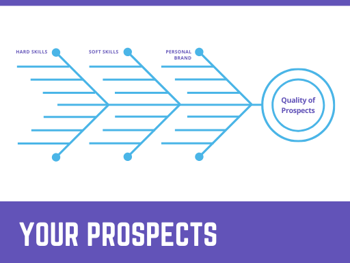
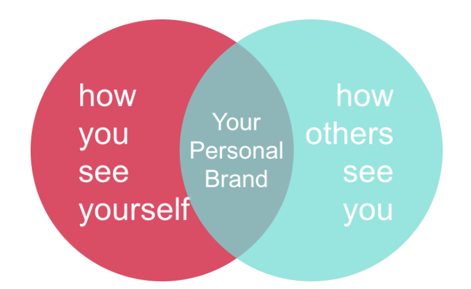
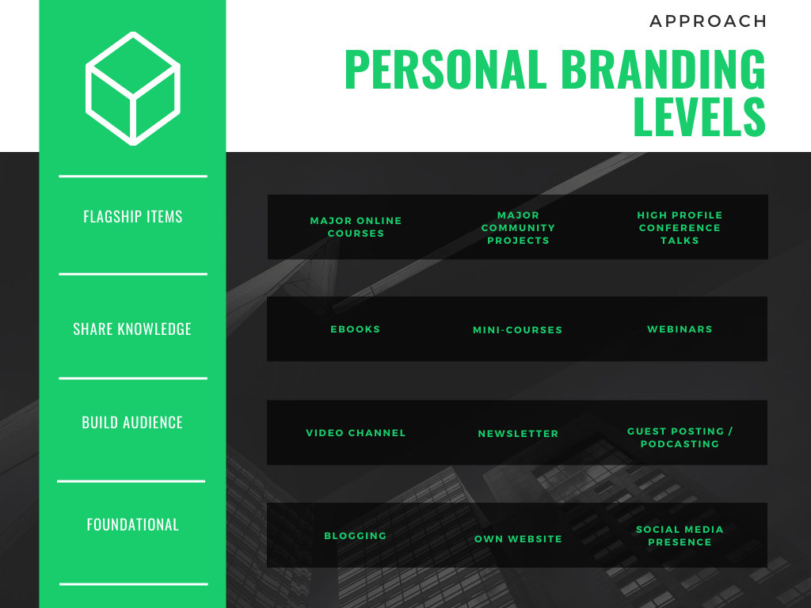

*Skip Down To*: 

**[Why You Should Care About Personal Branding](#whycare)** | **[Understanding Personal Branding](#whatis)** |
**[Key Tips](#tips)**

---

## Why You Should Care About Personal Branding

Yes, software development skills are in demand. And coding skills can get you a good job slowly. 
But software engineering skills **+ having a strong personal brand** can get you a 
**great** job quickly and with less effort.

You can think of personal branding as a multiplier. As a developer, your prospects or "luck surface area" 
are basically:

> Hard Skills (coding) x Soft Skills x Personal Brand = Your Career Prospects

>

Importantly, many parts of personal branding will also improve your soft skills (presenting & public speaking,
communicating, pitching, explaining).

Whether you like it or not, you are in competition with other great software developers for the most 
interesting jobs. Rather than 
grinding away on hacker rank for another month, why not consider higher leverage activities? This
practical guide will walk you through how to approach this challenge, regardless of your starting point.

Personal branding also makes getting an "OK" job incredibly easy. Whilst you probably don't want an
"OK" job, knowing that you have this kind of career moat is extremely valuable for feeling confident
taking a risk - e.g. starting a business, taking a sabbatical, taking time off to retrain, or confronting
your boss/organization to stand up for your principles.

In short, a strong personal brand is the second best thing to having "f*ck you" money.

---

## Understanding Personal Branding & Marketing Yourself
Marketing yourself and personal branding are two sides of the same coin. The subtle distinction is that
branding is how you "package" yourself and marketing yourself is how you get that package in front of other
people. The line tends to be quite blurred because often the way you brand yourself --such as blogging 
about a particular topic-- is a key part of the particular marketing strategy (SEO) that
gets you in front of people. Together these two inputs form an output: **Your reputation** 

#### Personal Branding Done Right is Ethical
For many developers, personal branding is synonymous with self-promotion and marketing, both of which
feel "slimy" and "weird".

> Does it feel weird getting a 25% raise?

> Does it feel weird landing your dream job?

In short, it would be beneficial to overcome these biases - and that doesn't mean compromising your
principles! Good personal branding and marketing is not about humble bragging. It is about **providing 
real value to other people**. Whilst doing this, you occasionally ask for something in return (which will also add value to that person's life).

#### Perception Matters
Another common objection, particularly among developers is that they don't want to pigeon-hole themselves
into one particular area. "That's not the real me". 

It helps to think of yourself as a product. If you claim to be able to do everything, hiring-managers and/or
recruiters will assume
you can do nothing. They also won't know how to search for you or what to recommend you for.

---

## Tips to Improve or Kickstart Your Personal Brand

Upfront let me be clear: Anyone can improve their ability to market themselves. It doesn't matter if you
don't have loads of Twitter followers, or 10 years of experience, or a shining resume. **Personal branding
is a teachable skill.**

For each of these tips on how to improve your personal branding, always think about them through the lens
of "how can I add value to others". This is the real secret.

Think about stacking these tips by difficulty and as part of a sequence. You don't want
to launch an online course if you've never marketed yourself before and don't have any kind of following
or readership. It's helpful to think of a rough hierarchy of difficulty (this will vary depending on your specific
circumstances) with your personal branding and marketing efforts. This diagram
gives an indication of these levels:

#### 1. Your Own Blog

You knew I was going to say this, so let's get into some useful specifics:

- **Target your blog at a particular niche where you can add valuable insights or commentary** This doesn't
 necessarily mean you are a master of it - you could provide useful insight into what it is like learning
 something as a beginner, or how to approach a problem you've not looked at before. If you blog on all kinds of unrelated topics you will get
 nowhere unless you are very lucky.
- **Learn the basics of Search Engine Optimisation (SEO)** A little bit of targeting goes a long way to 
avoid you just spinning your wheels. You should know what a canonical tag is. You should have
basic analytics set up so you can track your progress. A great starting point for 
this is [blogging for devs](https://bloggingfordevs.com/)
- **Be Patient and Consistent** Growing a blog takes time. Commit to a regular posting schedule.
- **Use Your Own Site** Don't build on someone else's
platform. Medium may not be here in a few years time, and you can always cross-post on these platforms
using the canonical tag to point back at your original blog (I've done that with this post, for example).
It also means that you can't be [accidentally shutdown](https://news.ycombinator.com/item?id=16672203)!
- **Collect email addresses from day 1** and consider this your key store of value. Do not skip this step.

A great book which has a practical mix of introduction and specifics on this topic is
 [*Technical Blogging* by Antonio Cangiano](https://pragprog.com/titles/actb2/)

#### 2. Create a Personal Website - Including a Portfolio
When someone Google's your name, they should see your personal website on the first page. If you have
a very common name, then throw a middle name in there. For this site, you want to ensure:

- You control the domain
- You showcase **achievements** preferably in the form of live projects people can go and look at or others
can verify.
- You make it very clear what you can do for other people/organizations. e.g. "Ruby developer"/"android engineer"
vs. "I optimize fintech backend systems to reduce cloud server costs" or "I create sleek front-end experiences
which drive conversions".
- Give people a way to connect/follow or generally interact with you.

Which is to say that you should specialize. This doesn't mean just one thing - this could be a powerful
combination of 2-4 areas which form your unique skill set. See the earlier section on getting over the fact that  
"who you are" is not really what you are trying to convey. Instead, you are trying to convey the key
ways you can create value. **Humans want to label you** - help them label you as "worth every penny".

The crux here is that you are making it easy for potential clients or potential employers to find reasons
to recommend you for hiring. 

#### 3. Get Good at (At Least) One Form of Social Media

I have a confession to make: I don't care about Twitter. At all. I'm probably leaving a huge amount of
potential personal branding opportunities on the table by not being active on Twitter. And I'm OK with that.
Because I know that the format just really turns me off. I also won't go near Facebook.
 
Instead, I've doubled down on a few I find more palatable (LinkedIn, Reddit, YouTube). I suggest you
do the same - pick a platform that you can see yourself spending time on and then start adding value there.
No one likes a humble brag - **add real value** and gradually start building your connections. You can
always direct people to your own website in your linkedin profile.

To take this to the next level, consider live streaming your activities through your youtube channel (
this is also a growing niche on
platforms like Twitch). This approach is becoming very popular, perhaps due to the ability to pick up [tacit knowledge](https://commoncog.com/blog/youtube-learn-tacit-knowledge/)),
and the increased authenticity of the live stream.

Harry Dry has some of the [best articles](https://marketingexamples.com/content/sharing) on how to do 
this effectively.

#### 4. Be a Guest (Blogger, Podcaster)
Everyone is starting a podcast in 2020. That might seem like a daunting amount of work to undertake
(although [Rumble Studio](https://rumble.studio/) can make it a lot easier). A great option to test
out the experience is to volunteer to be a guest on a podcast. Do your research and find podcasts
in your niche and then start cold emailing the hosts with a clear explanation of what you can offer.

Naturally, you'll want to start with the smaller podcasts and work your way up. This will be a great
test of your existing personal branding efforts!

#### 5. Show Your Code and Make Open-Source Contributions
- Make sure you have a GitHub/GitLab account and some code samples you can point people to
- Better yet, have some projects in your github
- Better still, have those projects be live with users
- A solid stack overflow score also sends a signal that you are passionate about the craft

Another angle is to contribute to open-source projects. I actually think this is one of the harder
approaches to take, but if done well it can send a very powerful signal. For example, the reason I follow
[Anthony Sottile](https://github.com/asottile) on Twitch is that I know he was a pytest core 
contributor. 

#### 6. Write an Ebook
They say that "ebooks are the new business cards". Whilst I think that downplays ebooks too much, it's
certainly easier than ever to self-publish an ebook, or offer a shorter ebook for free. 

For example, Andriy Burkov has gathered quite a following with his [Hundred-Page Machine Learning](http://themlbook.com/)
book.

#### 7. Create Online Courses

If you have an online course on a topic, it is a great way to convey subject authority, particularly
if you have a reasonable number of students. My online courses have more than 10k students, and this
has opened up a lot of opportunities for me in terms of job offers, speaking offers, paid blog posts,
getting funding and meeting super interesting people!

We have a [full guide on how to create an online course](/blog/create-sell-online-courses-ultimate-guide).

Getting started is easier than ever with [CourseMaker](/).

#### 8. Speak At Conferences

This is one most devs shy away from because it is intimidating. The truth is, a lot of smaller conferences
are always looking out for speakers. Ask around and you might be surprised, particularly if you can
put together a very clear talk outline. 

Another great tactic is to do a joint talk with someone who already has a track record (not necessarily a
software engineer either). Obviously you have
to have a relationship with such a person, but hopefully through your existing blogging/social media efforts
you are starting to foster these connections. This is how I was able to give my first major conference 
talk at PyData London.

#### 9. General Tips
- Use a consistent photo everywhere (make sure you have one)
- Use a consistent username
- Don't get into negative trolling or flame wars

## Further Reading
- [Swyx's guide to marketing yourself](https://www.swyx.io/writing/marketing-yourself/)
- [Edward Nevraumont's Guide to Co-Branding](https://www.marketingbs.com/post/million-compensation)
- [Where to host your online course](/blog/online-marketplace-vs-self-hosting-courses/)

---

*If you found this guide useful, please consider [signing up to our mailing list](/), as we produce quality content 
on a regular basis*