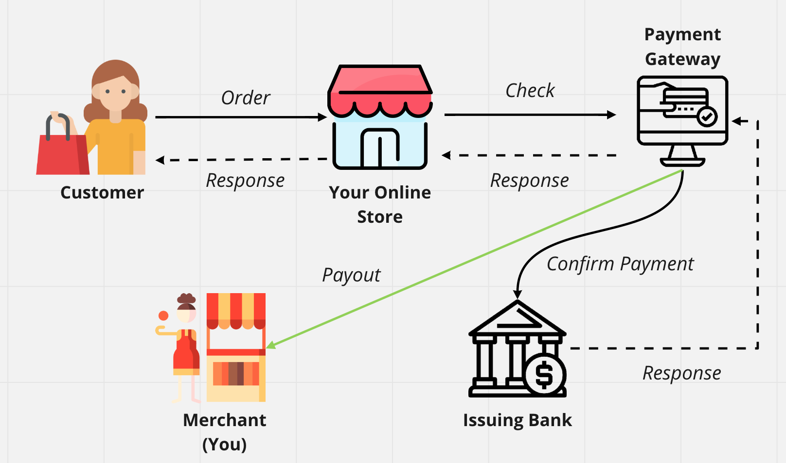
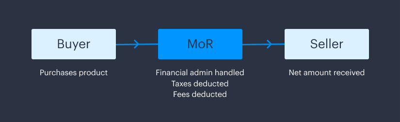
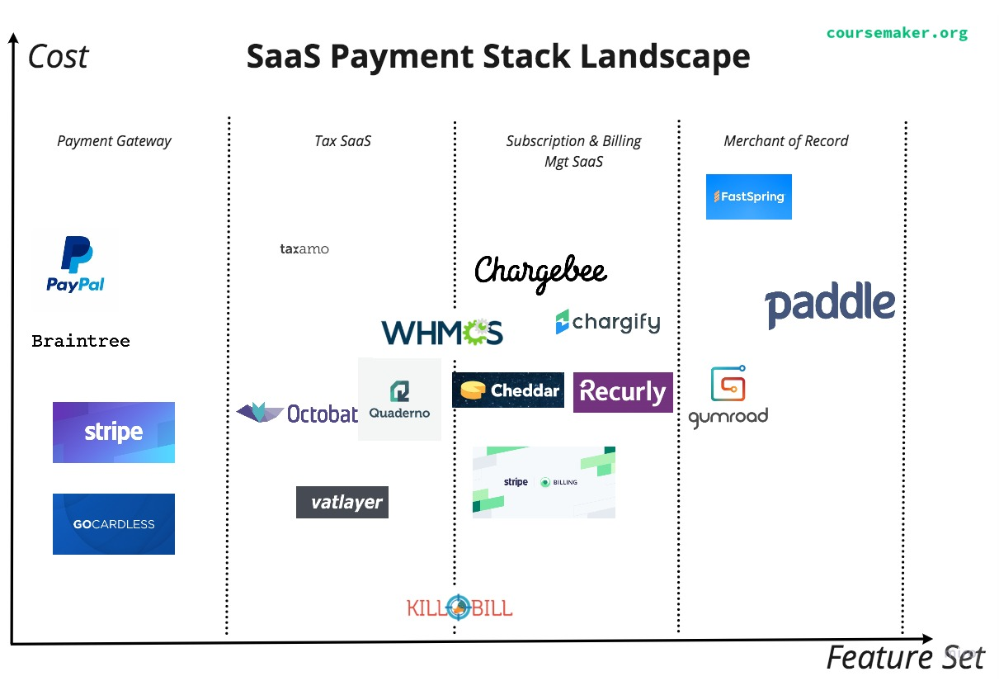
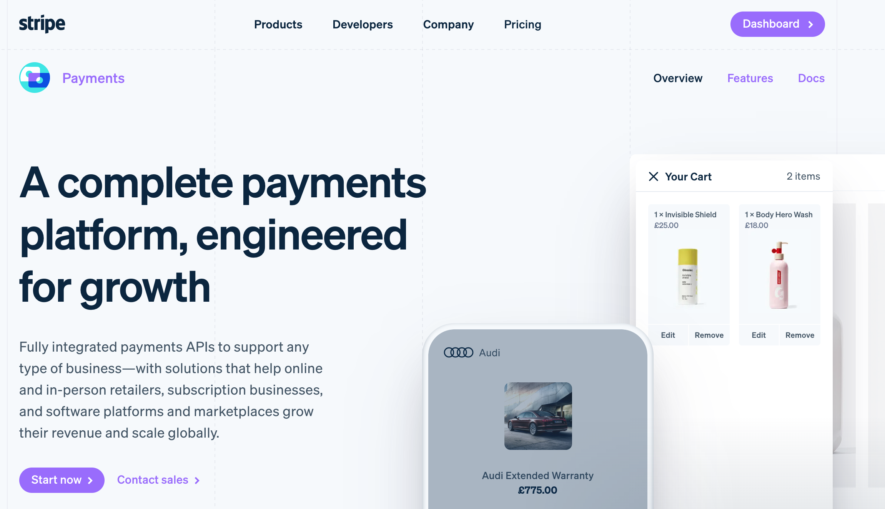
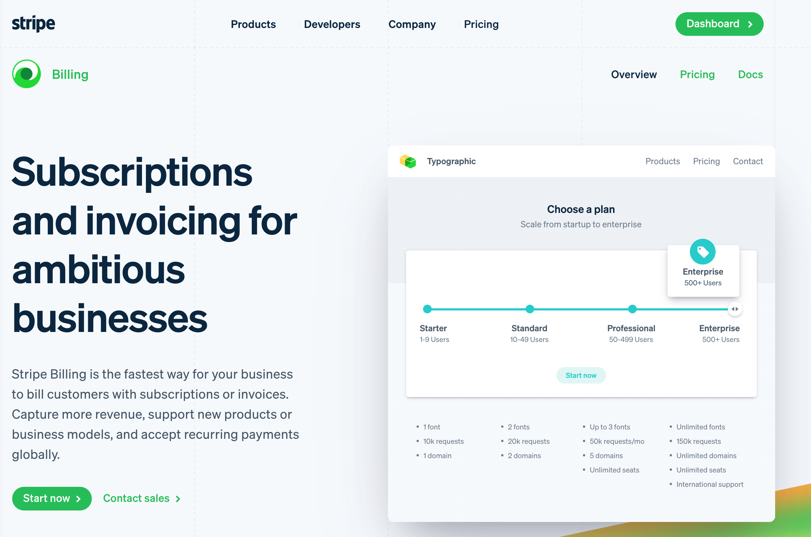
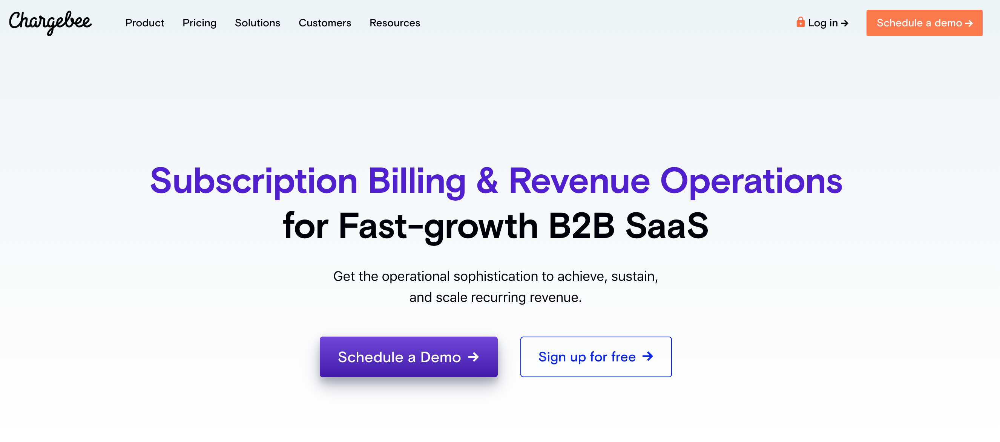
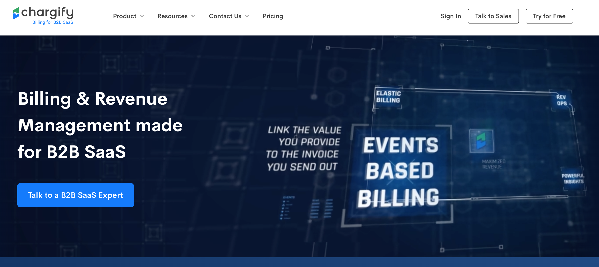
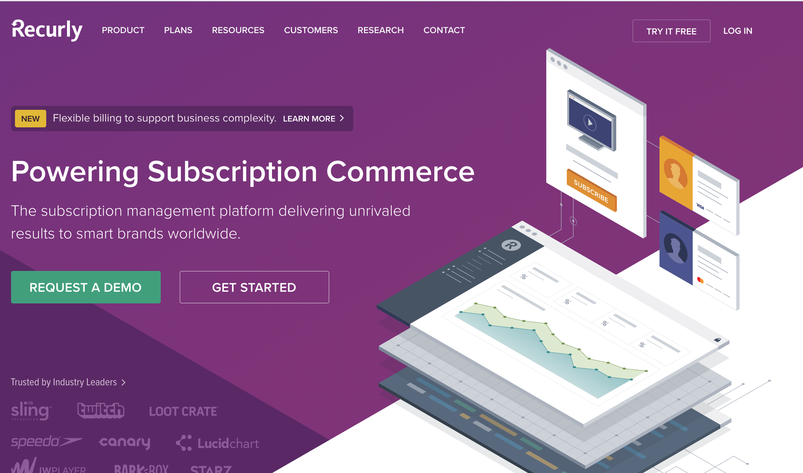
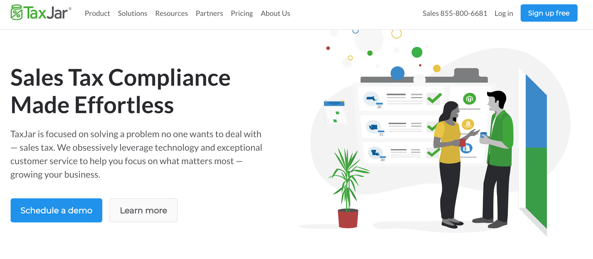

*Skip Down To*: 

**[Understanding the SaaS Payments Landscape](#landscape)** | 
**[Payment Gateways - Key Players](#gateway)** |
**[Subscription Billing Key Players](#subscription)** | 
**[Sales Tax Compliance Key Players](#compliance)** |
**[Merchant of Record Key Players](#merchantofrecord)**

Trying to figure out how to collect and manage subscription payments for your SaaS? The array of options, 
each with
subtle variations in available features, ~~can be confusing~~ is **very** confusing. 

This post will clear up some of the confusion around subscription billing for SaaS companies. It will
also outline the key players and their capabilities.

## Understanding the SaaS Payment Landscape

To begin, let's clarify some important terminology concepts.

#### Payment Gateway
[According to investopedia]:

>A payment gateway is a technology used by merchants to accept debit or credit card purchases from 
>customers

This isn't *that* clear, so let's get into more terminology and look at a diagram:

#### Merchant
"The Merchant" is a fancy way of saying you, i.e. an online business selling stuff.

#### The issuing bank aka issuer
The bank that a customer's credit/debit card is from - usually a major commercial bank.

#### The acquirer aka the acquiring bank
The acquiring bank processes payments on your behalf, and offers you what is known as a 
**merchant account**

Here's a diagram of the whole sequence:

*Role of the payment gateway*

There is an important distinction between a payment gateway and an acquiring bank (and the 
merchant account it provides you with), but for a lot of SaaS companies starting out this is obscured.
For example, Stripe is both a payment gateway **and** a merchant account. Fundamentally, the
payment gateway and the merchant account work together to conduct end-to-end payment processing. 
This means that you do not need to have a relationship with merchant banks yourself, nor with credit
card companies like American Express.

A crucial service that payment gateways offer is taking care of compliance requirements
around payments, notably [PCI compliance](https://www.pcicomplianceguide.org/faq/), which
is notoriously difficult to roll yourself.

If you're running a SaaS company, you still have three key issues to consider beyond a payment
gateway:

- Subscription Management
- Recurring Billing
- Sales Tax & Value Added Tax

### Subscription Management & Recurring Billing

#### Subscriptions
Subscriptions are the lifeblood of SaaS companies, producing the coveted Monthly Recurring Revenue (MRR). 
Whilst on the surface they can appear simple, there is a lot of logic involved in managing subscriptions such as:

- Managing trials
- Issuing refunds
- Dunning (a fancy name for retrying failed payments)
- Making changes to ongoing subscriptions
- Canceling

Many of these areas are crucial to get right for SaaS companies - slick free trials, elegant upgrades, 
monitoring churn, and gathering feedback during a cancellation to name a few.

#### Recurring Billing

Slightly different from subscription management is **recurring billing**. This is the process that allows
a business to invoice customers on a regular basis.

To make things more confusing, many payment gateways offer elements of subscription management and recurring
invoicing. For example, the [Stripe Billing](https://stripe.com/gb/billing) product works hand-in-hand with 
[Stripe Payments](https://stripe.com/gb/payments) to offer a robust subscription management solution and a
basic recurring billing capability. However recurring billing can get extremely complex, and as a result
there are a vast array of dedicated SaaS "Subscription Billing & Revenue Operations" companies that aim
to assist with this complexity. We'll look at some of the key players in a moment.

In case it wasn't clear, not all billing systems can handle subscription payments - instead just covering
the basics of a billing system such as managing billing cycles and invoicing. 

### Sales Tax & Value Added Tax

Many of the big payment providers provide no assistance when it comes to calculating requirements such as
EU Value Added Tax (EU VAT), US sales tax, and more exotic offerings such as Japan's "consumption tax", 
or India's GST. This in turn has resulted in many dedicated companies that provide services such as verifying
that a customer's IP address and credit card billing details are from the same country (required for EU
VAT calculations). 

---

If piecing together all these components to form a payment stack sounds like a lot of work to you, you're
not alone. That explains the final category to highlight: The Merchant of Record.

### Merchant of Record

A merchant of record basically does it all for you: They act on your behalf not only
to collect payment (i.e. acting as the payment gateway) but also to calculate the
appropriate tax and crucially to also remit that tax to the appropriate government
for you. In other words, this is a kind of authorized reseller relationship

*Source*: [paddle.com](https://paddle.com/blog/what-is-merchant-of-record/)

## What SaaS Businesses Need

If you are collecting recurring payments for your SaaS, you're likely to need 
a combination of both payment gateway, subscription management + billing, and probably sales tax
compliance. Many of the players we are about to discuss operate a hybrid model where
they offer solutions across the different categories defined above. Each has its 
strengths and weaknesses, which we will look into next. Needless to say, the sheer 
range of options can be overwhelming. Here is a graphic to give some perspective.

*Note: feature/pricing not to scale*

---

## Payment Gateway Key Players

### PayPal

Since the dawn of time (well, 1998) [PayPal](https://www.paypal.com/) has been a leading player in the 
online payments arena.

- Acts as a merchant account
- Integrates with [PayPal Subscriptions](https://developer.paypal.com/docs/subscriptions/)
- V. easy to find tutorials and/or hire assistance as this is the most common tool used for
collecting payments
- No setup fees

##### Costs (fees)
- 2.9% + $0.30 per transaction (within the US)
- 4.4% + $0.30 per transaction (outside the US)

### [Stripe Payments](https://stripe.com/payments)

It's pretty crazy to think that the mighty [Collison brothers](https://en.wikipedia.org/wiki/Patrick_Collison) 
launched Stripe as recently as 2011. It's now established itself as the go-to payment gateway for 
developers, offering a very high quality of API and documentation. Plus it integrates
seamlessly with Stripe's ever-expanding ecosystem. Key features:

- Includes merchant account
- Extensive set of APIs (developer-friendly)
= Stripe ecosystem which includes subscription management (via Stripe Billing)
- No setup fees

##### Costs (fees)
- 2.9% + $0.30 per transaction (non-European cards)
- 1.4% + $0.30 per transaction (European cards)

### Honorable Mentions
- [GoCardless](https://gocardless.com/)
- [Authorize.net](https://www.authorize.net/)
- [2Checkout](https://www.2checkout.com/)
- [Braintree](https://www.braintreepayments.com/) (owned by PayPal)

---

## Subscription Billing Software Key Players

#### Stripe Billing

[Stripe billing](https://stripe.com/billing) is basically the subscription business basic payments toolkit. It covers probably 80% of
small businesses' needs. When you start needing a more complex subscription management platform then
some of the other software companies in this list are where you would look.

Nonetheless, Stripe Billing offers a respectable feature set for a variety of business models, notably: 

- Variety of subscription pricing models (including usage-based)
- Promotions and trial periods
- Can customize billing frequency
- PSD2 compliance
- Variety of payment options
- Dunning
- Integrations (including Salesforce)
- Multiple subscription plans (plus upgrades and downgrades) 
- Basic billing process

##### Costs (fees)
- On top of Stripe payment costs, Stripe charges 0.5% for recurring charges

In the online payments space, perhaps the most opaque players to the layperson are the specialist recurring
platforms. These are the guys that add extra functionality required for a complex billing model - bells and whistles like credit notes, multilingual invoices, wide currency choices,
and automated reconciliation. Let's look at some of them now.

#### Chargebee

[Chargebee](https://www.chargebee.com/) is the sort of subscription management software you look at when you have annual recurring revenue (ARR) in the $1M - $20M
range, although they do have a nice [intro deal] (https://www.chargebee.com/launch/?ref=pricingPage) 
for startups.

**Key Benefits**
- Flexible automated billing software platform
- Subscription management
- Revenue recognition & reporting
- Dunning management
- ACH direct debit payments (via Stripe)
- Multilingual pages and invoices
- 100+ supported currencies
- Comprehensive analytics and subscription management product
- Can handle tax calculation across multiple regions

It's important to note that Chargebee does not ship with a payment gateway, so you need to factor that in.

##### Costs (fees)
- $299 - $599 + 0.6%-0.9% of revenue depending on the number of users, tax profiles and payment methods

#### Chargify

[Chargify](https://www.chargify.com/) is another platform for handling advanced billing
& revenue management for B2B SaaS.

**Key Benefits of Chargify Include**:
- Flexible automated billing platform 
- Subscription management
- Multi-gateway support
- iPhone App
- Dunning management
- Revenue recognition & reporting
- Easily experiment with multiple different product offers - tweaking product, price
and service
- Strong analytics 

Like Chargebee, they also expect you to integrate with a payment gateway of your choice.

##### Costs (fees)
- $299 - $499 + 0.9%-1% of revenue

#### Recurly

Recurly offers a variety of billing solutions for subscription billing such as:
- One-time charge pricing model (e.g. $550 for as an initial setup fee for a new
security system)
- Usage-based model (e.g. $55/month plus $0.03 per transaction)
- Seat-based model (e.g. $15/user per month for access to a SaaS tool)

Plus the basic fixed recurring model which you get from the likes of Stripe Billing. Because of
this flexibility, ecommerce (particularly SaaS) companies tend to use Recurly on top of an existing 
payment gateway and/or subscription management system. 

- [Recurly](https://recurly.com/)

### Honorable Mentions

- [Zuora](https://www.zuora.com/)
- [Cheddar](https://www.getcheddar.com/)
- [killbill](https://killbill.io/) (open-source)
- [WHMCS](https://www.whmcs.com/)
- [Moon Clerk](https://www.moonclerk.com/)
- [Zoho Subscriptions](https://www.zoho.com/subscriptions/)

---

## VAT & Sales Tax Compliance Key Players

Payment gateways mostly do not automate the calculation of sales tax and VAT for you. 
This means that you can:

- Pay the extra for a full-blown subscription & billing management system
- Integrate with a dedicated VAT & Sales Tax compliance platform or API
- "Roll your own" (usually not a practical option)

Dedicated sales tax platforms can vary from simple APIs through to complex SaaS tools
that integrate with your checkout and manage the invoice generation lifecycle.

The deal with these types of tools is that they only help you with sales tax/VAT/GST compliance.
So you need to integrate them with your existing payment gateway and (if applicable)
subscription management platform.

### Quaderno

[Quaderno](https://quaderno.io) has carved a decent reputation for itself in this niche. It calculates:
- US Sales Tax
- EU VAT (Required for all customers in Europe, not just Europe-based businesses)
- GST (Indian sales tax)
- And many more exotic taxes such as [Moldovan VAT](https://quaderno.io/resources/worldwide-tax-guides/moldova-vat-guide.html)

To be clear, it calculates the taxes, integrates with Stripe or PayPal checkouts to
apply correct pricing in real-time at checkout, and then provides you with ready-to-submit tax
reports. **However, it does not remit the taxes for you**

##### Costs
- $49 - $149 per month, depending on the number of transactions.

### TaxJar

[TaxJar](https://www.taxjar.com/pricing/) is more US-focused, but still can be 
useful for international businesses. Key benefits:

- Sales tax reporting and filing (you pay extra for filing)
- Can provide EU VAT reports (but won't do the filing for you)
- One of the key players so documentation and support is OKish (although I had
to get on the phone to them to answer a few basic questions). 

##### Costs
- $19 - $99 per month, ominously subtitled with "based on monthly orders"

### Honorable Mentions
- [Octobat](https://www.octobat.com/) another official Stripe partner
- [PayHip](https://payhip.com/) hidden gem
- [Taxify](https://taxify.co/)
- [Avalara](http://avalara.com/)
- [VATStack](https://vatstack.com/pricing) - API solution
- [VAT Layer](https://vatlayer.com/) - API solution
- [Taxamo](https://www.taxamo.com/)

---

## Merchant of Record Key Players

#### Paddle
[Paddle](https://paddle.com/) has become ultra-popular with bootstrappers due to its all-in-one capabilities. 
It's a stricter approach to vetting businesses means that it has upset fewer people with sudden account 
closures giving
them a [Trustpilot score](https://uk.trustpilot.com/review/paddle.com) of 4.8.

Key Benefits
- They handle all payment collection, invoicing, compliance and remitence on your behalf
in exchange for higher fees...
- ...Fees which are lower than most of the competition

Though Paddle may seem like a great option, you are cautioned to carefully review
their [extensive prohibited list](https://paddle.com/support/aup/), which is one of 
the more ambiguous documents on the internet.

##### Costs
- They don't advertise this on their website, but if you jump through the email contact
hoops the answer is 5% + $0.50 (as of July 2020)

#### FastSpring
[FastSpring](https://fastspring.com/) has been around for longer, but their more
permissive approach to vetting businesses seems to have worked against them with
a [TrustPilot score](https://uk.trustpilot.com/review/fastspring.com) of 2.4 which
is low enough to give any business owner pause. This poor customer experience is unlikely to be
due to a dearth of add-ons and seems to stem more from aggrieved customers who found their 
accounts suspended unexpectedly. 

##### Costs
- 5.9% + $0.95 per transaction

### Honorable Mentions
- [Gumroad](https://gumroad.com/)
- [Digital River](https://www.digitalriver.com/)
- [2Checkout](https://www.2checkout.com/)

---

## References

The merits of different payment platforms have been debated in key developer watering
holes on a number of occasions. Here are some of the most illuminating discussions:

- [Indie Hackers Feb 2020](https://www.indiehackers.com/post/would-you-use-paddle-chargebee-chargify-or-just-stripe-85830069b6)
- [Indie Hackers July 2019](https://www.indiehackers.com/post/how-does-your-europe-based-saas-collect-payments-taxes-are-hard-9a829d8d9e)
- [Indie Hackers May 2019](https://www.indiehackers.com/post/i-work-on-stripe-connect-ask-me-anything-7770395579)
- [Indie Hackers March 2018](https://www.indiehackers.com/forum/what-payment-gateways-did-you-use-when-you-first-launched-your-project-7deb53e267)
- [Hacker News July 2016](https://news.ycombinator.com/item?id=12160368)

Hopefully, this post has helped clarify the strange world of SaaS billing and payment processing. 

All the platforms and tools referenced in this post can now be found [awesome-saas-payments GitHub repo](https://github.com/CourseMaker/awesome-saas-payments).

---

*If you found this guide useful, please consider [signing up to our mailing list](/), as we produce quality content 
on a regular basis*