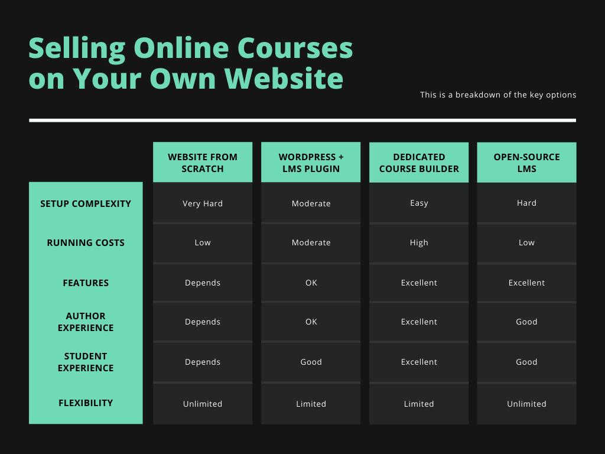
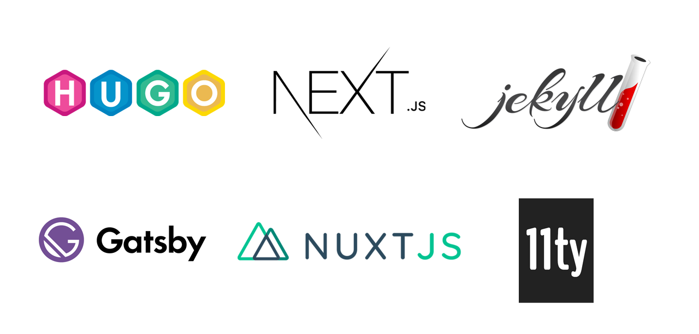
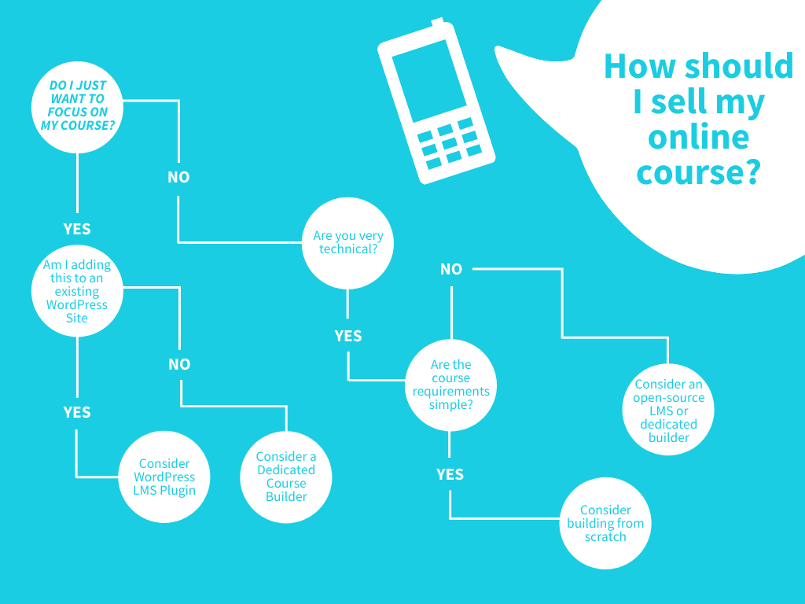

*note: If you are looking for a guide on the complete process of creating an online course [checkout our comprehensive
guide](/blog/create-sell-online-courses-ultimate-guide) (20 min read)*

**You've decided to sell your online course through your own website**. This can be an excellent
way to have complete control over your course business - you'll own your content, your student email list, and be
able to choose your business model and pricing, unlike if you [go on a marketplace like Udemy](/blog/online-marketplace-vs-self-hosting-courses).

The question now becomes: what are the options for selling
through your own website? There are a variety of choices out there, and in this guide I will walk you through
their pros and cons.

### Contents 

1. **[Part 1: Online Course Website Options](#options)**
2. **[Part 2: Creating an Online Course Website From Scratch](#scratch)**
3. **[Part 3: Using an open-source learning management system (LMS)](#open)**
4. **[Part 4: Using WordPress and LMS plugins](#lms)**
5. **[Part 5: Using a generic website builder](#generic)**
6. **[Part 6: Using a dedicated online course builder](#builder)**
7. **[Part 7: Evaluating What Is Right For You](#evaluation)**

---

## Online Course Website Options

Assuming that you want to go beyond a simple email course (which can be done without any website) and that you would
like to monetize your content (i.e. not just put it on youtube for free), then you have the following options:

1. Creating an online course website from scratch - requires technical skills or paying a developer
2. Using an open-source learning management system (LMS) - requires technical skills or paying a developer
3. Using WordPress and LMS plugins - can be done without technical skills if you're ready to read up
4. Using a mass-market, generic website builder
5. Using dedicated eLearning software - can be done easily by anyone

### The Pieces of an Online Course Website

For each of the options we just saw, it's important to ensure they can provide at least the basic building
blocks you will need for an online course

- **Hosting**: You need a way to make your site available so others can view it
- **Lecture creation**
- **Video streaming**
- **Payments**: Handling things like different currencies, payment methods and Value Added Tax (VAT)
- **Capturing student data** (basics such as storing contact details, but also tracking student progress
so that students can pick up where the left off)
- **Course Performance**: Easily track sales, revenue, and profit

#### Advanced Features
- **Memberships**: Allow you to bundle multiple courses into a subscription product
- **Sales promotion**: Things like creating coupons so you can run marketing campaigns and offer discounts
- **Sales funnels**: Optimize your sales process with things like affiliates and upsells

What follows is a breakdown of each of the course website options. If you want to skip ahead to how to 
evaluate the right option for you then see the [evaluation section](#evaluation)

---

## Creating an Online Course Website From Scratch

The good news is that even if you don't know how to code, the complexity and cost for someone else to build a basic
course website has dropped a lot in recent years. This is largely due to the rise of static site generators. Here is a
[comprehensive list of static site generators](https://www.staticgen.com/)). 

Don't worry if you've not heard of the tools above. The key thing to understand is that 
these static site generators allow you to create websites *without* any kind of backend or server. The static
sites that these tools output are just 
a bundle of Javascript, HTML, and CSS. This is great news because it means the **cost of hosting the website is much
lower** - in
fact, on services such as [netlify](https://www.netlify.com/) there is a hosting free tier. 

Because there is no backend logic,
the complexity of building the site is reduced (which means it can be built for less). As if that wasn't enough, since
your site is now just a collection of files, you can serve it through a content delivery network (CDN) and it will be
incredibly fast (which is great for SEO).

#### Pros
- ✅ You have complete control over your site features
- ✅ Once built, your running costs will be low
- ✅ There are many tools out there to help you build a site like this, such as [snipcart](https://snipcart.com/blog/choose-best-static-site-generator) 
for e-commerce, or [Auth0](https://auth0.com/) for identity

#### Cons
- ❌ You have to build and/or pay someone to build your site. To reach feature parity with some of the other options
described in this post is likely to take years. 
- ❌ You have to think about things like compliance (VAT payments, GDPR), and performance (using content delivery networks,
video streaming)

---

## Using an Open-Source Learning Management System (LMS)

There are a number of major open-source learning management systems out there. Some of the biggest players
include [Moodle](https://moodle.org/) and the [OpenEdX Platform](https://open.edx.org/). These are all very
large codebases that you will need to be an experienced developer to understand and work with (for example,
here is the [docker-compose file](https://github.com/edx/devstack/blob/master/docker-compose.yml) to spin up 
the OpenEdX Platform on your local machine). The good news is that these platforms are extremely have almost
every feature imaginable.
The bad news is that they come with a lot of features which you won't need, which increases setup complexity.

#### Pros
- ✅ Extremely feature-rich
- ✅ Free updates as the open-source platform development progresses
- ✅ You can inspect the code, meaning that there is total transparency around what is possible

#### Cons
- ❌ Requires technical expertise to setup, customize, and host
- ❌ Legacy codebases tend to look and perform worse
- ❌ A lot of features you probably don't need (increases complexity of getting things done)

---

## Using WordPress and LMS plugins

[WordPress](https://en.wikipedia.org/wiki/WordPress) is the world's most popular Content Management System (CMS).
It is designed to be versatile and it so it does have support for paid learning management system (LMS) plugins 
which can enable online-course features. 
The most popular of these is LearnDash. This can be a good option 
for people already running a WordPress site, 
because you will still need to figure out the hosting, video storage, subscriptions, SEO and content delivery 
network alongside your WordPress setup. 

If you already are running WordPress you may have most of these
already figured out. In that case, one additional LMS plugin might be a good option. 
If you're starting from scratch, you will find yourself with quite a lot of work to do.

#### Pros
- ✅ Can be setup with minimal technical expertise
- ✅ Designed with online courses in mind
- ✅ Good feature set

#### Cons
- ❌ You still have to piece together things like hosting, payments, compliance, SEO and a content delivery network
- ❌ The WordPress admin is not a slick course author experience
- ❌ Can be expensive

---

## Using A Generic Website Builder for Your Online Course
You might be familiar with some of the mass-market website builder platforms out there, such as [Squarespace](
https://www.squarespace.com/) or [Wix](https://www.wix.com/). These are great options if you just want to build
a normal website. However, for building an online course
they are likely to be a bad fit. Why is that? Fundamentally, their workflows are not geared around things like
creating lectures, student learning experience, or creating multiple courses within one site. Nor are these larger
players geared towards providing analytics you need around things like student 
progress and lesson completion rates. 

Whilst it would be possible to produce a basic course using generic video uploads and a standard checkout process,
this is almost certainly your worst option from those available. 

#### Pros
- ✅ No technical expertise required
- ✅ Very easy to use
- ✅ Low pricing

#### Cons
- ❌ Not designed for online course creation - many missing features

---

## Using a Dedicated Online Course Builder

Dedicated online course builders such as teachable or CourseMaker offer an online course website creation
experience that is tailored towards those who are building online courses. This means that things like 
creating lectures, tracking student progress, sales dashboards, compliance, and all the features you need
to create an online course are available out-of-the-box. These platforms also take care of hosting your site
and video content, meaning that you are paying for an all-in-one service, rather than piecing together 
different bits of functionality.

This is the fastest and most-hassle free way to get started creating an online course. 

#### Pros
✅ The easiest way to build an online course (no technical knowledge required)
✅ All the functionality you need - no extra hassles
✅ All compliance (Payment VAT, taxes, GDPR) taken care of

#### Cons
- ❌ Tends to be more expensive
- ❌ The platform can make changes you have no control over (e.g. pricing, features)

---

## Evaluating What Is Right For You

Without a doubt, the easiest way to create your own course website is using a dedicated online course creation
platform. However, if you're already very familiar with WordPress, then an LMS plugin is worth considering. Whilst
both of these options do tend to be pricier, you are buying a smooth experience, assistance with your marketing
and sales process and compliance piece of mind. 

If you are very technical, then building using a static site generator and piecing together the components for payments,
CRM and compliance is an option - you just have to consider how much your time is worth. Similarly, I would only
recommend the open-source LMS option for those who are technical and ready to dive into some very complex setup and
hosting work. 

Attempting to build your online course website using a mass-market tool is unwise, you are going to be struggling
due to lack of dedicated features, like trying to make an elephant dance.

Here is a rough guide to making the decision:

Good luck with creating your online course website!

---

*If you found this guide useful, please consider [signing up to our mailing list](/), as we produce quality content 
on a regular basis*