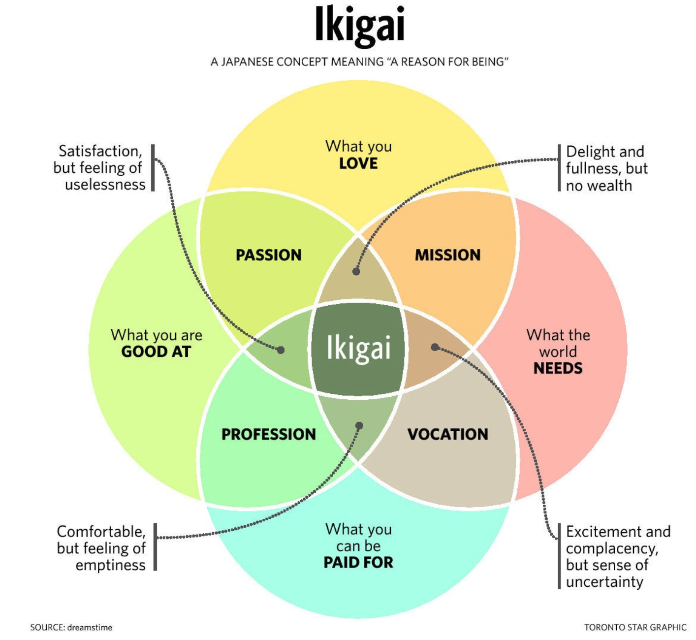

This website is called CourseMaker - naturally, we want you to make online courses! 
But we value honesty, and the truth is that creating an online course is not “super easy” as 
some of the social media gurus and influencers would have you believe. Having said that, if done correctly, 
creating online courses can be extremely rewarding, speaking from personal experience and from 
seeing the success of countless online course creators.

## Online Course Potential Benefits

Whilst additional income (potentially becoming your main income) is the obvious benefit, there are more pros to consider.

#### Financial Benefits

Online courses are info products distributed via the internet, which means that they do not require you to sell your time for money. In short, a well-designed course makes you money while you sleep. Furthermore, because the marginal costs (i.e. the cost of selling one additional course) on each course sold are close to zero, then you have no income “cap”. You can potentially make millions of dollars selling online courses, although this will require a combination of skill and luck.

Note that I say the marginal costs are _close_ to zero, and I’ll talk more about things like support queries in the negatives section below.

Whilst huge financial success is not the norm, it is very common for online courses to make decent sales amounts, ranging from a few hundred to many thousands of dollars per month. This can start out as a nice bit of extra cash every month, grow to a meaningful side income stream that pays some of the bills and eventually become a full time job if you persevere.

#### Personal Brand & Career Benefits

In today’s competitive job market, having a course on a topic (particularly if it has a significant number of students) is a great way to signal expertise. Stacking these kinds of signals (i.e. building accomplishments and sharing them), is a powerful way to grow your personal brand. [Growing your personal brand opens up a lot of opportunities](http://localhost:8000/blog/improve-personal-branding-software-developers)

In terms of your own skill growth, being forced to assess and break down topics during course creation 
into manageable chunks can reveal subtle gaps in your own understanding which you will fill as you build out your course. In short, teaching a topic improves your understanding of it, a method often referred to as the [Feynman technique](https://www.scotthyoung.com/learnonsteroids/grab/TranscriptFeynman.pdf) after the nobel winning scientist Richard Feynman. Your students will also ask you difficult questions! Sometimes this will open up angles and views which you might otherwise never have come across.

#### Generating Sales & Leads

In some cases, an online course may be a product which a customer can then opt to accompany with services such as coaching, consulting and in-person workshops. In short, the course can be bundled with other services, or used to upsell other services. Some clients may not be willing to pay for a lot of consulting initially, but may reconsider after taking an online course.

#### Existential Benefits

You can reach thousands or even millions of students through a successful online course. This is pretty mind-boggling - you can add value to so many people’s lives using the lever of technology. Messages from delighted students, and the knowledge that you’re helping large numbers of people can create very meaningful work which can help you feel more fulfilled in your life.

---

## Online Course Potential Negatives

As I said from the start - it’s not all sunshine and rainbows.

#### The Risk of Building the Wrong Thing
Like any product, it is possible for an online course to flop and not be a commercial success. 
The key here is to make sure you [validate your idea before beginning to work on your course content](/blog/create-sell-online-courses-ultimate-guide/#validation). 
It is important to focus on the student learning experience, and the transformation that will occur in
their lives *before* and *after* they take your course. 
Nonetheless, there are no guarantees in entrepreneurship and so this is a risk you can reduce but not eliminate.

#### Creating an Online Business

Even if you sell your course through a marketplace business model rather than your own site (see here for a [detailed comparison of the two options](/blog/online-marketplace-vs-self-hosting-courses)) you will still want to promote your course to maximize your returns. 
Granted, a marketplace takes a portion of the burden away, but you usually receive a larger profit 
share when you are sending traffic to your courses. 

When it comes to self-hosting then marketing is absolutely critical, and it will basically be 
“crickets” without a decent marketing approach. 
This means that whilst you may just want to focus on creating your online course and on choosing
your learning management system, 
the reality is you also need to consider all the things which go into an online business such as:

*   Marketing & Growing an Audience
*   Web Hosting
*   [Technology choices](http://localhost:8000/blog/why-create-online-course-reasons-for-against/sell-online-course-your-own-website)
*   Bookeeping, taxes and compliance
*   Customer support (more on this below) & testimonials

#### Customer Support

Course creators building their first online course often don't realise quite how much work a successful course can be once it is live. Students will comment, email and generally look for feedback. Whilst you can make your life easier by preparing FAQs, mentioning useful resources for further reading, encouraging students to Google common issues before asking questions, and providing lecture notes with common gotchas, there will still be a constant stream of student interaction. This is something you need to allocate time for, as slow responses are a great way to ruin your relationship with your students. This is obviously even more important in online learning models where you are offering additional coaching or webinar sessions to students. 

This is the most important caveat to the promise of passive income when it comes to online courses. It applies whether you are on a marketplace like Udemy or skillshare, or whether you've setup your own site. 

#### Product Shelf-Life

Online courses age. This is a brutal reality of the online course business - unless you create the 
"go-to" course on a timeless topic like Calculus, then your material will go out of date as 
technology, marketing, sales, design and attitudes change. You can then go back and either refresh 
a course, or in some cases move on to new topics and create a new course. This can feel like a 
bit of a treadmill, so you have to strike a balance between being at the cutting edge (and hence 
having less competition) and choosing topics which will be relevant for a few years so that your 
course can produce revenue for a decent stretch of time.

This is the complexity/reward trade-off. Online courses tend to have more linear growth than
a Software as a Service (SaaS) business, but are more likely to succeed. Both are part of what
Nathan Barry calls the "Selling Products" [ladder of wealth creation](https://nathanbarry.com/wealth-creation/).

---

## Are you ready to create an online course?

#### An Online Course Requires Focus

Now that we’ve clarified why you might want to create an online course, let’s focus on what it takes.

Creating an online course is a significant commitment. You are building a product.

Depending on the course topic, you may need to set aside time for research and supporting material preparation, beyond simply creating the course lectures. Whilst there are ways to massively simplify the recording process, editing your videos still takes time. 

That’s not to say it’s not worth doing - it absolutely is, but you should go in with the mindset that this is something you are going to have to devote considerable mental energy to. 
>If you’re in the middle of starting a new job, moving house, about to have a baby, or struggling with your mental health or burnout, I would advise waiting for a moment when you will have more energy and time for the endeavor.

#### Do You Have Something To Teach?

The chances are that you are the "go-to" person for some topics at work or among your social circle. The key thing to analyse is which of your unique skills *combinations* can be turned into a successful first course. We discuss the process for [deciding what to teach](blog/create-sell-online-courses-ultimate-guide/#deciding) in our complete guide. 

#### Do You Have An Audience?

Beyond the creation of the course, there is the marketing of it. Any existing following you have among your 
course's target audience is going to be a significant advantage - an email list, social media or podcast 
following, youtube channel etc. If you are unsure if now is the right time for you to build a course, focusing on building your audience can be an excellent idea in the interim period, as this will also allow you to ask your followers about their problems and interests. If you can genuinely help people through your free content (newsletter, blog posts, videos), 
they will be happy to pay for your online course once you decide you are ready.

For a detailed breakdown on how to create an online course [checkout our complete guide](/blog/create-sell-online-courses-ultimate-guide/)

---

*If you found this guide useful, please consider [signing up to our mailing list](/), as we produce quality content 
on a regular basis*